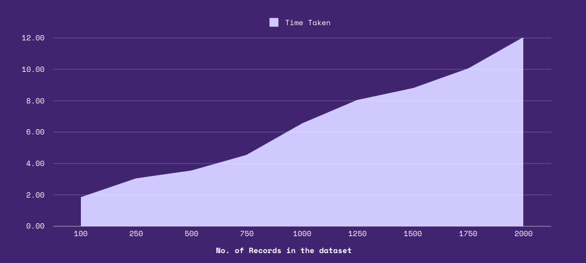
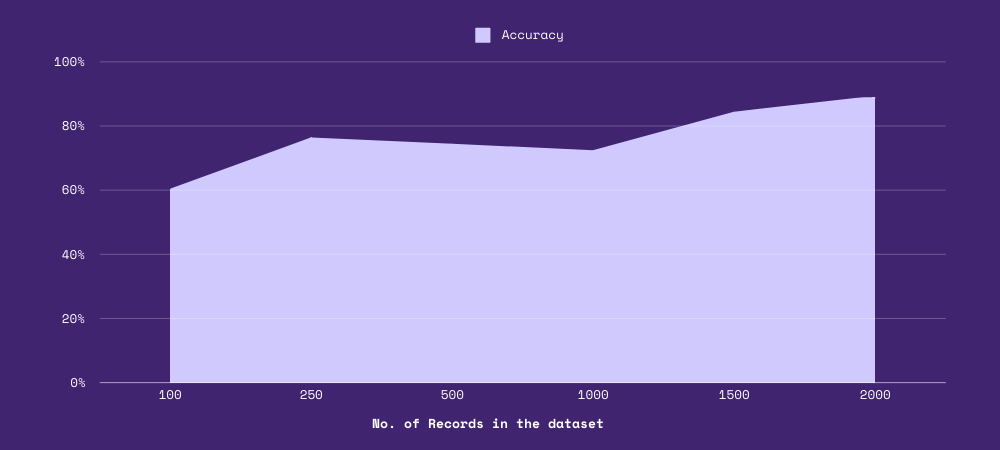

# C-based Spam Email Classifier


A simple yet effective C-based spam email classifier using a Naive Bayes approach.

## Table of Contents
- [Overview](#overview)
- [Features](#features)
- [How It Works](#how-it-works)
- [File Structure](#file-structure)
- [Getting Started](#getting-started)
- [Usage](#usage)
- [Performance](#performance)
- [Future Scope and Improvements](#future-scope-and-improvements)

## Overview

This project implements a basic spam email classifier in C. It uses a Basic Naive Bayes algorithm to categorize emails as either spam or not spam based on the words they contain, completely written in C. The classifier is trained on a dataset of labeled emails, learning the probability of each word appearing in spam and non-spam emails. It then uses this information to predict the class of new emails based on the words they contain. The implementation is lightweight and fast, making it suitable for small to medium-sized datasets.

## Features

- Train on a dataset of labeled emails
- Predict whether new emails are spam or not
- Simple and lightweight implementation in C
- Fast execution with runtime measurement
- Model saving and loading functionality

## How It Works


---

#### If you like to read, here is the explanation: :)

1. **Data Loading**: Emails are loaded from a text file using the data loader.
2. **Training**: The classifier learns from a set of pre-labeled emails, counting the occurrences of words in spam and non-spam emails.
3. **Tokenization**: Emails are broken down into individual words (tokens).
4. **Probability Calculation**: For each word, the probability of it appearing in spam and non-spam emails is calculated using Laplace smoothing.
5. **Prediction**: New emails are classified by calculating the overall probability of being spam or not spam based on the words they contain.
6. **Model Persistence**: The trained model can be saved to a file and loaded later for predictions without retraining.

## File Structure

- `main.c`: Main program file containing the entry point and command-line interface
- `spam_classifier.h`: Header file with function declarations and constants for the spam classifier
- `spam_classifier_impl.c`: Implementation of the spam classifier functions
- `data_loader.c` and `data_loader.h`: Functions for loading email data from files
- `model_io.c` and `model_io.h`: Functions for saving and loading the trained model

## Getting Started

### Prerequisites

- GCC compiler

### Compilation

To compile the project, you can use the following command in the project directory:

```
./run_project.sh
```


## Usage

### Training and Testing

To train the model and test it on a dataset:

```
./spam_classifier
```

This will load the email data, train the model, test it, and save the model to a file.

### Predicting

To use the trained model for predicting on new emails:

```
./spam_classifier --predict
```

This will load the saved model and allow you to input emails for classification.

## Performance

The classifier's performance can be evaluated based on:

1. **Accuracy**: Printed at the end of the test phase, showing the percentage of correctly classified emails.
2. **Execution Time**: Displayed in milliseconds, showing the total time taken for training and testing.

---

#### Time Taken Graph for Training and Testing vs Dataset Size


#### Accuracy vs Dataset Size



Note: The performance may vary depending on the size and quality of the training dataset, as well as the characteristics of the emails being classified. The current dataset is created by the me and is not a real-world dataset.

## Future Scope and Improvements

- Implement more advanced text processing techniques like TF-IDF, stemming, and stop-word removal.
- Experiment with different probability estimation methods and feature selection techniques like chi-square.
- Add more evaluation metrics like precision, recall, and F1 score.
- Generalize the classifier to handle multiple classes and improve the model persistence functionality.